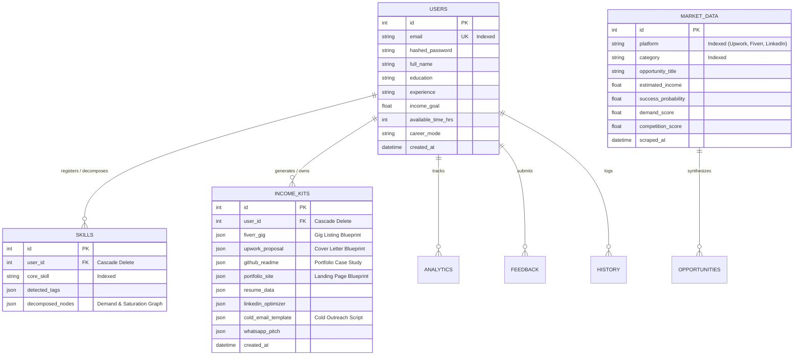

# 🏛️ Skill to Income Engine (SIE) — Database Architecture & Data Layer

This document describes the production database architecture, entity relationships, connection pooling policies, and migration workflows for the **Skill to Income Engine (SIE)** powered by **Neon Serverless PostgreSQL**.

---

## 1. Architecture Overview

The SIE data layer is designed around an asynchronous, decoupled relational model that maps raw human skill profiles directly into market opportunity signals and actionable career income blueprints.

- **Engine**: PostgreSQL 15+ (Serverless Neon Architecture)
- **ORM & Data Mapping**: SQLAlchemy 2.0 (Declarative Base)
- **Schema Migration Engine**: Alembic
- **Connection Model**: Pooled TCP over SSL (`sslmode=require`) with pre-ping validation



---

## 2. Detailed Table Specifications

### 2.1 `users`
Core identity, authentication credentials, and personalized onboarding preferences.

| Column | Type | Nullable | Constraints & Defaults | Description |
|---|---|---|---|---|
| `id` | `INTEGER` | No | Primary Key, Auto-increment | Unique identifier |
| `email` | `VARCHAR` | No | Unique, Indexed | Authentication identity |
| `hashed_password` | `VARCHAR` | No | Bcrypt Hash | Securely salted password hash |
| `full_name` | `VARCHAR` | Yes | Nullable | User display name |
| `education` | `VARCHAR` | Yes | Nullable | Onboarding education level |
| `experience` | `VARCHAR` | Yes | Nullable | Background experience summary |
| `income_goal` | `FLOAT` | Yes | Nullable | Monthly income target ($) |
| `available_time_hrs` | `INTEGER` | Yes | Nullable | Weekly time commitment in hours |
| `career_mode` | `VARCHAR` | Yes | Nullable | Primary monetization modality |
| `created_at` | `TIMESTAMPTZ`| No | Default: `now()` | Account creation timestamp |

**Relationships**:
- Cascading `all, delete-orphan` link to `skills`, `income_kits`, `history`, `analytics`, and `feedbacks`.

---

### 2.2 `skills`
Stores normalized core skills and algorithmic/LLM-decomposed micro-service node payloads.

| Column | Type | Nullable | Constraints & Defaults | Description |
|---|---|---|---|---|
| `id` | `INTEGER` | No | Primary Key, Auto-increment | Unique skill entry |
| `user_id` | `INTEGER` | No | Foreign Key (`users.id`), Cascade | Owning user account |
| `core_skill` | `VARCHAR` | No | Indexed | Core competency (e.g. "Python") |
| `detected_tags` | `JSON` | Yes | Array | Associated sub-skills & libraries |
| `decomposed_nodes`| `JSON` | Yes | Array of Objects | High-demand deliverable nodes |

**Sample `decomposed_nodes` JSON Payload**:
```json
[
  {
    "id": "skill-101",
    "skill": "Python",
    "microService": "Python ETL pipeline automation",
    "category": "Automation",
    "demand": 91,
    "competition": 33,
    "suitability": 95,
    "trend": "+24%",
    "beginnerFriendly": true,
    "description": "Build reusable extraction and transformation pipelines."
  }
]
```

---

### 2.3 `market_data`
Aggregates live platform signals, search demand volume, and competition densities across freelancing platforms.

| Column | Type | Nullable | Constraints & Defaults | Description |
|---|---|---|---|---|
| `id` | `INTEGER` | No | Primary Key, Auto-increment | Unique signal ID |
| `platform` | `VARCHAR` | No | Indexed | Target platform (Upwork, Fiverr, etc.) |
| `category` | `VARCHAR` | No | Indexed | Industry vertical |
| `opportunity_title`| `VARCHAR` | No | String | Deliverable market opportunity |
| `estimated_income` | `FLOAT` | No | Number | Average expected revenue ($) |
| `success_probability`| `FLOAT`| No | Range 0.0 – 1.0 | Statistical win likelihood |
| `demand_score` | `FLOAT` | No | Range 0.0 – 10.0 | Demand volume index |
| `competition_score`| `FLOAT` | No | Range 0.0 – 10.0 | Saturation penalty index |
| `scraped_at` | `TIMESTAMPTZ`| No | Default: `now()` | Ingestion timestamp |

---

### 2.4 `income_kits`
Execution blueprints generated by Layer 4 containing publication-ready gig copies, case studies, landing pages, and cold pitch templates.

| Column | Type | Nullable | Constraints & Defaults | Description |
|---|---|---|---|---|
| `id` | `INTEGER` | No | Primary Key, Auto-increment | Unique blueprint ID |
| `user_id` | `INTEGER` | No | Foreign Key (`users.id`), Cascade | Owning user account |
| `fiverr_gig` | `JSON` | Yes | Object | Service listing copy & pricing tiers |
| `portfolio_site`| `JSON` | Yes | Object | Landing page copy & CTA |
| `github_readme` | `JSON` | Yes | Object | Proof of Work & Case Study outline |
| `cold_email_template`| `JSON` | Yes | Object | High-conversion outreach sequences |
| `upwork_proposal` | `JSON` | Yes | Object | Custom bidding proposal copy |
| `created_at` | `TIMESTAMPTZ`| No | Default: `now()` | Generation timestamp |

---

## 3. Production Hardening & Connection Pooling (Neon)

Neon is a serverless, autoscaling PostgreSQL service. Direct unpooled connections can cause connection thrashing or idle connection starvation during load spikes. The backend configures SQLAlchemy engine pooling with the following hardened parameters:

```python
engine = create_engine(
    settings.SQLALCHEMY_DATABASE_URI,
    pool_size=5,          # Persistent connection count per worker
    max_overflow=10,      # Elastic burst connections above pool_size
    pool_pre_ping=True,   # Validates connection health before query execution
    pool_recycle=300,     # Recycles connection every 5 minutes to prevent stale TCP drops
)
```

---

## 4. Alembic Migration History & Execution

Alembic maintains full schema version history within the PostgreSQL database table `alembic_version`.

### Migration Ledger
1. **`6835327fa801`** (`initial_database_schema`):
   - Created base tables: `users`, `skills`, `market_data`, `income_kits`.
   - Established indexed email constraints and foreign key relationships.
2. **`6840b148d0a7`** (`add_missing_models_and_relationships`):
   - Added tables: `analytics`, `feedback`, `history`, `deployments`, `opportunities`.
   - Added cascade delete triggers and multi-column indexes.

### Automated Migration Command Runbook
```bash
# Verify current migration level against Neon database:
alembic current

# Run forward migrations to latest version (Head):
alembic upgrade head

# Rollback one migration revision if needed:
alembic downgrade -1

# Generate a new revision from model diffs:
alembic revision --autogenerate -m "describe_changes_here"
```
